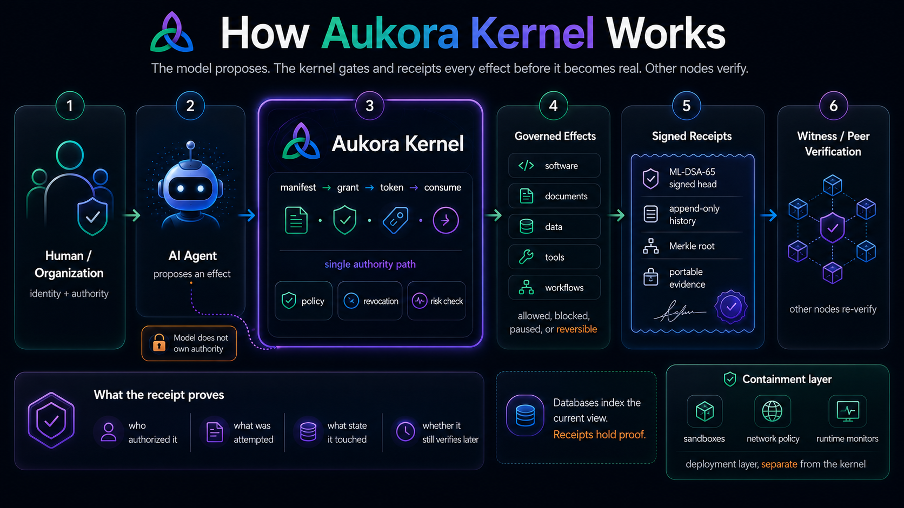

# Aukora Kernel

> **A model proposes. The kernel gates and receipts every effect before it becomes real. Other nodes verify.**

The Aukora kernel is the authorization-and-receipt core of a personal node: every effect an agent realizes is gated by a
signed capability, mediated through a single consume chokepoint, and cryptographically receipted into an append-only
history that any peer can re-verify. The one law it enforces — *authority is minted only by signature and spent at most
once* — holds across nodes, partitions, and format versions.

In plain English: Aukora is a trust layer for the AI era. It lets an AI agent touch software, documents, data, tools, or
workflows only through a human- or organization-bound authority path. Every meaningful effect can leave a signed,
post-quantum receipt proving who authorized it, what was attempted, what state it touched, and whether the evidence still
verifies later.



## Why it matters

Aukora is a governance layer for AI agents. It lets an AI agent do useful work — write code, edit files, search memory,
propose actions, or operate through an adapter — without letting the model own authority. The agent can propose or
attempt an effect; Aukora decides whether that effect is allowed, blocked, recorded, or reversible.

The broader stack combines identity, permissions, receipts, memory, and adapters. A human or node binds authority through
an identity ceremony, agent engines connect through adapters, risky effects pause, safe effects can proceed, and every
important move can be recorded with cryptographic receipts. Memory, graph, glyph, and topology layers can then help the
system remember what happened and explain why something was allowed, blocked, or related to prior events.

The big idea is that AI agents are moving from chat boxes into real systems. Aukora is the control plane above them: it
gives agents hands, but keeps law, identity, proof, and rollback outside the model. That means organizations can use
stronger AI without blindly trusting it.

## Post-chain authority, not another blockchain

Blockchain proves that transactions were signed, ordered, and finalized by a network. Aukora is aimed at a different
problem: **authorized effects**. In an AI-native world, the key question is not only "did this key sign a transaction?"
It is: *who authorized this intelligence to act, what was it allowed to touch, what state changed, what evidence proves
that chain of custody, and can another node verify it without trusting the model?*

Aukora's primitive is a signed receipt graph for governed state change. A database can index the current view; the
receipts are the portable evidence. Convex, filesystems, IDEs, cloud services, and future node networks can all be
implementation surfaces, but the trust object is the content-addressed, signed, independently verifiable receipt chain.

This is why Aukora is **post-chain** infrastructure: cryptographic trust for AI-mediated state change without forcing
every meaningful effect onto a global blockchain. Blockchains may still be useful as optional witnesses or anchors.
Aukora does not require a token, coin, fee market, global consensus ledger, or public chain to prove that a governed
effect or artifact verifies.

See [`docs/AUKORA_POST_CHAIN_AUTHORITY_GRAPH.md`](docs/AUKORA_POST_CHAIN_AUTHORITY_GRAPH.md) for the larger architecture:
causal authority graphs, policy-bound execution, portable proof bundles, witness meshes, state commitments, rights and
capabilities, and why this can generalize beyond agents into documents, media, workflows, and machine-to-machine trust.

## Verifiable artifacts: documents, media, exports, and code

Aukora is not only for agent actions. The same kernel spine can receipt **any digital artifact**: a PDF, contract,
dataset export, source file, model output, research note, media file, or database snapshot. The kernel hashes the
artifact bytes, binds the hash to typed metadata, chains the receipt into an append-only history, and signs the head
with ML-DSA-65. Change one byte of the artifact, rewrite its metadata, swap receipt order, truncate history, or verify
with the wrong key — the verifier fails closed.

That turns the kernel into a local-first trust layer for the post-AI web: not a cryptocurrency, not a token, and not a
claim that the content is "true," but proof that a specific artifact existed in a specific state under a specific
custody chain. Agents can write, humans can approve, organizations can audit, and peers can re-check the evidence
without trusting model prose.

The first headless implementation is [`convex/aukoraArtifactCustody.ts`](convex/aukoraArtifactCustody.ts), covered by
[`tests/artifactCustody.test.ts`](tests/artifactCustody.test.ts). See
[`docs/AUKORA_ARTIFACT_CUSTODY.md`](docs/AUKORA_ARTIFACT_CUSTODY.md) for the exact flow and threat model.

## Who benefits

1. **Finance, trading, and banking** — agents can help with code, research, reports, and infrastructure without being
   allowed to leak keys, alter trading systems, or bypass approvals.
2. **Healthcare and biotech** — AI can assist with records, research, workflows, and diagnostics support while keeping
   patient data, approvals, and audit trails governed.
3. **Defense and government** — agents can operate around sensitive systems with strict identity, permission, memory, and
   receipt controls instead of uncontrolled automation.
4. **Software and cloud infrastructure** — coding agents can modify systems, while risky edits, secrets, deletes,
   deploys, and production changes can be blocked or separately approved.
5. **Legal and compliance** — AI can draft, review, and organize sensitive material while preserving evidence trails,
   permissions, source memory, and reversibility.
6. **Insurance and risk management** — agents can analyze claims, contracts, and risk data while every action remains
   auditable and policy-bound.
7. **Energy and critical infrastructure** — AI can help manage complex systems without being able to silently alter
   dangerous controls or operational configs.
8. **Manufacturing, robotics, and supply chain** — agentic systems can coordinate machines, workflows, and maintenance
   while Aukora governs what they are allowed to change.
9. **Telecommunications and network operations** — AI can help monitor and repair networks while protecting credentials,
   routing configs, and critical infrastructure changes.
10. **Research, education, and enterprise knowledge systems** — AI can build knowledge systems, labs, tutors, and
    research agents with durable memory, source-backed reasoning, and transparent provenance.

## What it does

- **Signs every effect** with post-quantum **ML-DSA-65** (FIPS 204) under a versioned, purpose-domain-bound signed-head
  format — the algorithm is bound into the signed bytes (downgrade-resistant), with no fallback mode.
- **Receipts every effect** into an **RFC 6962 append-only Merkle history root** committed inside the signed head, which
  the audit path recomputes from the actual receipts and re-verifies.
- **Receipts arbitrary artifacts** into the same evidence spine: hash the bytes, bind typed metadata, sign the chain
  head, and fail closed on one-byte content tamper, metadata rewrite, row reorder, truncation, or wrong signer.
- **Conserves authority**: a live effect is authorized only through `manifest → grant → token → receipt`, flowing through
  one shared consume chokepoint with an OCC use-counter — no second authority path, no double-spend.
- **Verifies peers**: a witness checks a peer's history head as an append-only `(size, root)` consistency extension and
  records a signed, non-repudiable finding on an equivocation (a same-size / different-root fork).
- **Confidential transport** (optional, off by default): an **ML-KEM-768** (FIPS 203) key-establishment + AEAD channel
  adds confidentiality to a witness poll — it gates and mints nothing; strip it and every verdict is byte-identical.
- **Ships closed**: a clean deploy publishes no live HTTP surface — every route is flag-gated and returns `404` until
  explicitly enabled.

## What it is — and is not

This is a **PROVEN-LAB** kernel: each property above is exercised by the in-repo test suite (`npx vitest run`). It is a
research/engineering artifact, **not a production system**. Honest fences:

- The system is **tamper-evident** (receipts detect tampering after the fact), **not** tamper-proof.
- The post-quantum **signing spine** is corroborated against NIST ACVP vectors; this is corroboration, **not** an
  independent cryptographic audit, and **not** a blanket "quantum-secure system" claim.
- Identity is **self-sovereign at birth**, with an operator-custodied lifecycle (no built-in recovery — by design).
- No claims of consensus, global finality, public-transparency networks, trusted global time, anonymity, or
  metadata privacy.

See [`CLAIMS.md`](CLAIMS.md) for the exact claim → evidence → tier table.

## Authority vs. containment — what this layer does and doesn't do

A common first reaction: "but what if the agent just bypasses the kernel?" Correct — and intentional. This is the
**authority layer**, not the containment layer. They are different problems:

- **Authority** (this kernel): cryptographically proves *what was authorized, by whom, under what scope, and whether it
  was spent*. Makes every governed effect independently verifiable and tamper-evident. This is the hard part to get
  right — single-path consumption, append-only receipts, post-quantum signatures, cross-node witness verification.
- **Containment** (deployment infrastructure): forces all agent I/O through the authority layer. Sandboxes
  (Firecracker, gVisor), network policies (iptables, security groups), runtime monitors (seccomp, eBPF) — these are
  well-understood, off-the-shelf tools.

Without the kernel, containment is just a sandbox with no accountability — you can trap the agent but you can't
prove what it did or whether it was authorized. Without containment, the kernel is an audit trail — complete and
cryptographically sound, but only over effects routed through it. Together they form the full system.

The kernel is what's hard to *build correctly*. Containment is what's hard to *deploy correctly*. This repo is the
authority layer.

## Build & test

```bash
npm ci
npx vitest run
```

> CI is not yet configured. The suite must be run locally before any commit.

## License

[AGPL-3.0-or-later](LICENSE). See [`NOTICE`](NOTICE) for third-party attributions and [`CONTRIBUTING.md`](CONTRIBUTING.md)
to contribute.
