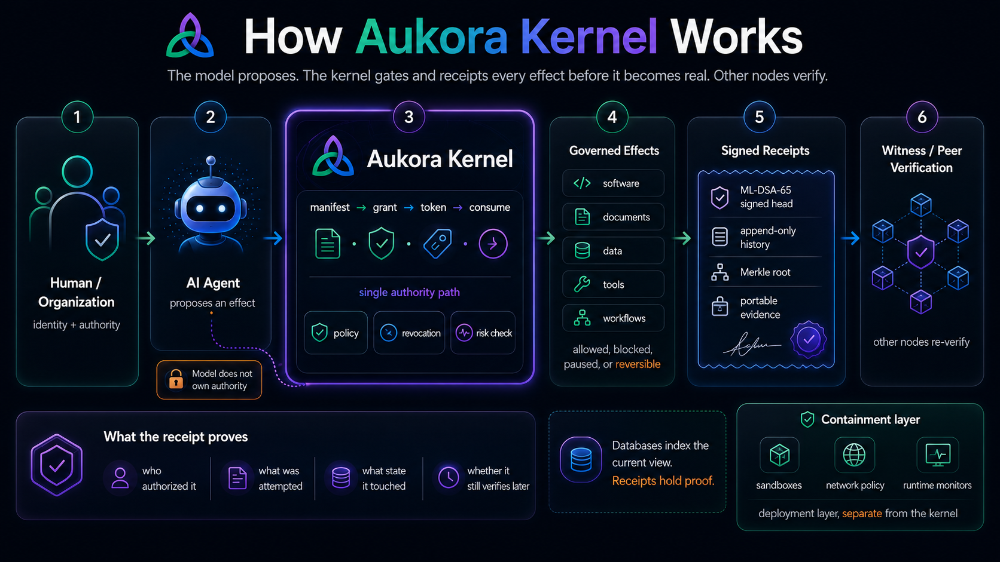

# Aukora Kernel

> **A model proposes. The kernel verifies authority, advances replay state, and drafts evidence. Adapters execute.**

## Repository status

This public Round-23 checkpoint also contains the wider Aukora organism under explicit namespaces. Start with [`ORGANISM.md`](ORGANISM.md) for the authority map, donor provenance, implemented-vs-design status, quarantine boundary, and consolidation rules. [`PUBLICATION_BLOCKERS.md`](PUBLICATION_BLOCKERS.md) is intentionally open; this repository is already public, and those items track remaining consolidation, hardening, and IP-review work rather than a pending publish decision.

The Kernel itself has two deliberately separate layers:

- `packages/kernel` is the portable `@aukora/kernel` verifier/reducer. It has
  no Convex, filesystem, network, environment, ambient-clock, custody, signing,
  transport, or live-execution capability.
- `convex` is the broader PROVEN-LAB reference application. It demonstrates
  persistence, custody experiments, witness/transport lanes, and adapter
  behavior; those capabilities are not part of the portable package contract.

Start with [the five-minute quickstart](docs/QUICKSTART.md), then inspect the
[exact package boundary](docs/KERNEL_V0_BOUNDARY.md) and frozen
[`decide(...)` vectors](packages/kernel/conformance/).

The Aukora kernel is the authorization-and-receipt core of a personal node. The
portable package deterministically decides, advances replay state, and drafts
evidence; it never signs, persists, or executes. A conforming adapter must
atomically persist an allowed consumption before executing an effect. Together,
that creates one reviewable law: authority is verified under a declared profile
and a consumption is accepted at most once.

In plain English: Aukora gives an adapter a deterministic contract for deciding whether an AI-proposed effect is
authorized, consuming that authority once, and producing evidence to be signed by a custody layer. The portable verifier
can later check who authorized the request, what state transition was claimed, and whether the evidence still verifies.



## Why it matters

Aukora is a governance layer for AI agents. It gives builders primitives for agents to propose work without letting the
model own authority. The agent proposes an effect; the kernel returns a deterministic decision and next state; a
conforming adapter controls persistence and execution.

The broader stack combines identity, permissions, receipts, memory, and adapters. A human or node binds authority through
an identity ceremony, agent engines connect through adapters, risky effects pause, safe effects can proceed, and every
important move can be recorded with cryptographic receipts. Memory, graph, glyph, and topology layers can then help the
system remember what happened and explain why something was allowed, blocked, or related to prior events.

The big idea is that AI agents are moving from chat boxes into real systems. Aukora is the control plane above them: it
gives agents hands, but keeps law, identity, proof, and rollback outside the model. That means organizations can use
stronger AI without blindly trusting it.

## Post-chain authority, not another blockchain

Blockchain proves that transactions were signed, ordered, and finalized by a network. Aukora is aimed at a different
problem: **authorized effects**. In an AI-native world, the key question is not only "did this key sign a transaction?"
It is: *who authorized this intelligence to act, what was it allowed to touch, what state changed, what evidence proves
that chain of custody, and can another node verify it without trusting the model?*

Aukora's primitive is a signed receipt graph for governed state change. A database can index the current view; the
receipts are the portable evidence. Convex, filesystems, IDEs, cloud services, and future node networks can all be
implementation surfaces, but the trust object is the content-addressed, signed, independently verifiable receipt chain.

This is why Aukora is **post-chain** infrastructure: cryptographic trust for AI-mediated state change without forcing
every meaningful effect onto a global blockchain. Blockchains may still be useful as optional witnesses or anchors.
Aukora does not require a token, coin, fee market, global consensus ledger, or public chain to prove that a governed
effect or artifact verifies.

See [`docs/AUKORA_POST_CHAIN_AUTHORITY_GRAPH.md`](docs/AUKORA_POST_CHAIN_AUTHORITY_GRAPH.md) for the larger architecture:
causal authority graphs, policy-bound execution, portable proof bundles, witness meshes, state commitments, rights and
capabilities, and why this can generalize beyond agents into documents, media, workflows, and machine-to-machine trust.

## Verifiable artifacts: documents, media, exports, and code

Aukora is not only for agent actions. The same kernel spine can receipt **any digital artifact**: a PDF, contract,
dataset export, source file, model output, research note, media file, or database snapshot. The kernel hashes the
artifact bytes, binds the hash to typed metadata, chains the receipt into an append-only history, and signs the head
with ML-DSA-65. Change one byte of the artifact, rewrite its metadata, swap receipt order, truncate history, or verify
with the wrong key — the verifier fails closed.

That turns the kernel into a local-first trust layer for the post-AI web: not a cryptocurrency, not a token, and not a
claim that the content is "true," but proof that a specific artifact existed in a specific state under a specific
custody chain. Agents can write, humans can approve, organizations can audit, and peers can re-check the evidence
without trusting model prose.

The first headless implementation is [`convex/aukoraArtifactCustody.ts`](convex/aukoraArtifactCustody.ts), covered by
[`tests/artifactCustody.test.ts`](tests/artifactCustody.test.ts). See
[`docs/AUKORA_ARTIFACT_CUSTODY.md`](docs/AUKORA_ARTIFACT_CUSTODY.md) for the exact flow and threat model.

## What an engineer can verify in five minutes

From a clean checkout, `npm run test:kernel` demonstrates concrete portable
properties rather than a deployment promise:

1. identical request, state, canonical policy bytes, and caller-supplied time
   produce an identical decision, next state, and unsigned receipt draft;
2. unknown fields, versions, domains, algorithms, and authority profiles refuse;
3. an AUMLOK promotion requires both Ed25519 and ML-DSA-65 signatures over the
   same canonical payload, while the distinct V4 receipt profile cannot substitute;
4. a first allowed consumption advances replay state and a repeated consumption
   refuses;
5. receipt, Merkle, and artifact evidence fails verification after tampering,
   reordering, truncation, or key substitution;
6. the package produces the same frozen results in Node, Bun, Edge Runtime, and
   a browser-targeted bundle;
7. the packed tarball installs into an empty consumer and contains no Convex,
   filesystem, network, environment, custody, signing, or execution surface.

These are integration primitives for governed software. Whether a particular
deployment is suitable for a regulated, safety-critical, or production setting
requires its own containment design, adapter audit, operational controls, and
independent review; this repository makes no such deployment claim.

## What it does

- **Verifies authority by declared profile**: portable AUMLOK promotions require
  both Ed25519 and **ML-DSA-65**; portable V4 receipt heads use a separate,
  purpose-bound ML-DSA-65-only profile. Unknown profiles and downgrade attempts
  refuse. The broader Convex reference app retains its legacy ML-DSA-only head.
- **Verifies receipt histories** against an **RFC 6962 append-only Merkle root** committed inside a signed head; the
  reference adapter demonstrates append and audit behavior.
- **Verifies arbitrary-artifact evidence** in the same spine; the reference application demonstrates hashing bytes,
  binding typed metadata, signing a chain head, and detecting content or history tampering.
- **Conserves authority**: a live effect is authorized only through `manifest → grant → token → receipt`, flowing through
  one shared consume chokepoint with an OCC use-counter — no second authority path, no double-spend.
- **Verifies peers**: a witness checks a peer's history head as an append-only `(size, root)` consistency extension and
  records a signed, non-repudiable finding on an equivocation (a same-size / different-root fork).
- **Confidential transport** (optional, off by default): an **ML-KEM-768** (FIPS 203) key-establishment + AEAD channel
  adds confidentiality to a witness poll — it gates and mints nothing; strip it and every verdict is byte-identical.
- **HTTP routes ship closed**: a clean deploy publishes no custom HTTP route —
  every route is flag-gated and returns `404` until explicitly enabled. Direct
  Convex client functions are a separate surface, frozen in
  `security/convex-public-surface.json`. Plain exported authority dependencies,
  including the disabled-by-default demo session resolver, are independently
  frozen in `security/convex-authority-seams.json`.

## What it is — and is not

This is a **PROVEN-LAB** kernel: each property above is exercised by the in-repo test suite (`npx vitest run`). It is a
research/engineering artifact, **not a production system**. Honest fences:

- The system is **tamper-evident** (receipts detect tampering after the fact), **not** tamper-proof.
- The ML-DSA-65 **verification path** agrees with a pinned NIST ACVP FIPS 204 pass/refuse subset; this is corroboration, **not** an
  independent cryptographic audit, and **not** a blanket "quantum-secure system" claim.
- Identity is **self-sovereign at birth**, with an operator-custodied lifecycle (no built-in recovery — by design).
- **No execution proof**: nothing here proves the process actually running is the audited code. A compromised host can
  hold a valid signing key and emit valid-looking receipts. Closing this needs reproducible builds + an external
  witness + a trusted execution environment, none of which ship here.
- Receipts are **self-reported**: the kernel signs and chains caller-supplied fields (grade, verdict, risk) — it proves
  *what was reported*, not that the report is accurate.
- No claims of consensus, global finality, public-transparency networks, trusted global time, anonymity, or
  metadata privacy.

See [`CLAIMS.md`](CLAIMS.md) for the claim → evidence → tier table, [`LIMITATIONS.md`](LIMITATIONS.md) for the full
honest fence-line, and [`SECURITY.md`](SECURITY.md) for the trust model and honest residuals.

## Authority vs. containment — what this layer does and doesn't do

A common first reaction: "but what if the agent just bypasses the kernel?" Correct — and intentional. This is the
**authority layer**, not the containment layer. They are different problems:

- **Authority** (this kernel): cryptographically proves *what was authorized, by whom, under what scope, and whether it
  was spent*. Makes every governed effect independently verifiable and tamper-evident. This is the hard part to get
  right — single-path consumption, append-only receipts, post-quantum signatures, cross-node witness verification.
- **Containment** (deployment infrastructure): forces all agent I/O through the authority layer. Sandboxes
  (Firecracker, gVisor), network policies (iptables, security groups), runtime monitors (seccomp, eBPF) — these are
  well-understood, off-the-shelf tools.

Without the kernel, containment is just a sandbox with no accountability — you can trap the agent but you can't
prove what it did or whether it was authorized. Without containment, the kernel is an audit trail — complete and
cryptographically sound, but only over effects routed through it. Together they form the full system.

The kernel is what's hard to *build correctly*. Containment is what's hard to *deploy correctly*. This repo is the
authority layer.

## Build & test

```bash
npm ci
npm run test:kernel
npm run verify:convex-surface
npm test -- --reporter=dot
node packages/kernel/examples/observe.mjs
```

`npm run test:release` runs the portable-package gates (`test:kernel`), the Fu
evidence/council canonical-boundary and Fu-harness gates (`test:fu`,
`test:fu-app`), the preserved Symbiote core + Convex suites (`test:symbiote`), the
organism-source provenance check (`verify:organism-sources`), the Convex
callable-surface freeze (`verify:convex-surface`), and the legacy Convex reference
suite. Note: `test:symbiote` was newly wired in and currently surfaces one
pre-existing `apps/symbiote/core` failure (`policyKernel.test.ts` oracle
disagreement on `EXPORT_EXCLUSIONS.txt` / `RELEASE_MANIFEST.sha256`, reproducible
on the prior main) — so `test:release` is expected to fail at that step until the
Symbiote-core oracle is corrected. This is intentional: green root CI previously
did not exercise the Symbiote organism at all.

## License

[AGPL-3.0-or-later](LICENSE). See [`NOTICE`](NOTICE) for third-party attributions and [`CONTRIBUTING.md`](CONTRIBUTING.md)
to contribute.
