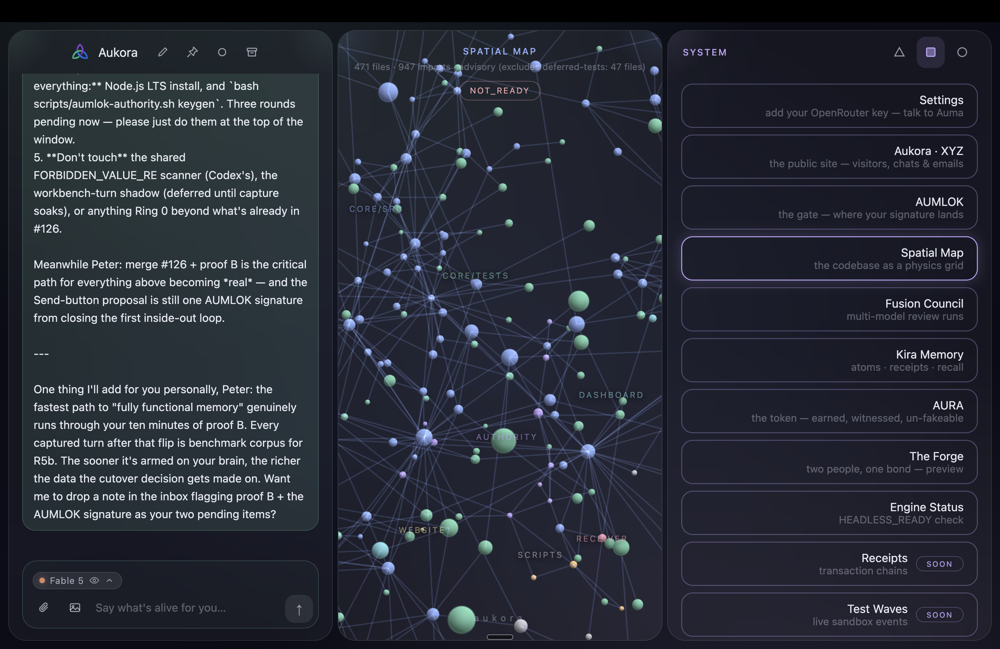

# Aukora Symbiote

**A local-first AI operating system for a governed digital organism.**

Aukora runs a full node on your machine: spatial UI, chat door, local memory brain, AUMLOK signing gate, Fusion review, app organs, and a self-modification loop that can draft changes to itself but cannot apply them without the owner.

It is not a chatbot wrapper. It is a receipt-bearing local runtime where an AI presence can read its own code, propose edits, rehearse them in a sandbox, show evidence, and wait at your gate.

The line is simple:

```text
Auma proposes -> sandbox rehearses -> Fusion reviews -> AUMLOK signs -> code lands with a receipt
```

No signature, no apply.

---

## What This Is

Aukora is a **sovereign local node** with three layers:

- **Body:** the Spatial app at `127.0.0.1:7090`, where the organs live.
- **Brain:** a loopback-only Convex backend plus Kira memory/retrieval machinery.
- **Law:** AUMLOK, policy rings, sandbox gates, shrink warnings, receipts, rollback paths, and secret scans.

Each node keeps its own private state outside the repo in `~/.aukora-symbiote/`.

That means:

- Your OpenRouter key is local.
- Your AUMLOK signing key is local.
- Your memory brain is local.
- GitHub carries code, not your private mind.

---

## The Shape



The app can feel strange because it is not organized like a normal dashboard. It is closer to a local control room: chat, apps, memory, review, identity, signatures, experiments, and a live self-edit loop all sharing one shell.

Technical map:

- `127.0.0.1:7090` — Spatial UI, the body.
- `127.0.0.1:7091` — Auma chat door, the voice/tool membrane.
- `127.0.0.1:7094` — AUMLOK approval gate, the owner signature surface.
- `127.0.0.1:3210` — local Convex brain, loopback-only durable memory.
- `~/.aukora-symbiote/` — private node state: keys, memory, receipts, capture status.
- GitHub — shared code and PRs, not private memory.

---

## Install

### 1. Install Bun

Aukora uses Bun for the local runtime.

macOS / Linux:

```bash
curl -fsSL https://bun.sh/install | bash
```

Windows PowerShell:

```powershell
powershell -c "irm bun.sh/install.ps1 | iex"
```

Restart your terminal after installing Bun.

### 2. Clone The Node

Ask the owner to add your GitHub account as a collaborator if the repo is private. `git clone` is recommended because it lets you pull updates and push branches; downloading a ZIP also works for a first look, but it is worse for collaboration.

```bash
git clone https://github.com/aumara-xyz/aukora-symbiote.git
cd aukora-symbiote
```

### 3. Start It

```bash
bun run start
```

First run brings up the local stack:

- installs lightweight runtime dependencies;
- downloads/provisions the local Convex backend for your OS;
- starts the memory brain on `127.0.0.1:3210`;
- starts the Spatial app on `127.0.0.1:7090`;
- starts the chat door on `127.0.0.1:7091`;
- starts the AUMLOK approval gate on `127.0.0.1:7094` when the node is bound;
- opens the app in your browser.

Keep the terminal open if you start it directly. If your node is supervised by PM2, `bun run stop` now stops the Spatial, chat, AUMLOK, bind, ARC3, and auto-drain doors cleanly.

### 4. Add Your Model Key

Open:

```text
System -> Settings
```

Paste your own OpenRouter key. It is stored locally on your machine and never shown back by the app.

### 5. Get Your AUMLOK

Open:

```text
System -> AUMLOK
```

If the node is unbound, the app starts the binding door and walks you through creating your local owner key. If it is already bound, you will see the signing gate.

Create your AUMLOK phrase:

1. Click **Create my phrase**.
2. Write it down.
3. Type it back.
4. The local gate stores only a salted fingerprint.

The phrase is not the key. It is the human-facing ceremony. The private signing key stays on your machine and every apply still requires local key custody plus your typed approval.

### Updating Later

```bash
git pull
bun run stop
bun run start
```

Your key, phrase fingerprint, memory rows, capture status, and node-local receipts live outside the repo. Updating code does not overwrite your local identity.

---

## Use It

### Talk To Auma

Open the left chat lane. Auma can answer, inspect the repo through fenced read tools, draft intents, queue rehearsals, and read evidence when those tools are enabled.

Useful phrases:

```text
status
map yourself
search <thing>
agent: change the Send button color to teal
run: --from-proposal <proposal-id>
```

### Drive The Canvas

Open:

```text
Apps -> Canvas
```

Then open the pinned thread:

```text
DEV · Canvas
```

Try:

```text
html: <div style="color:teal;font-size:42px">pipe check</div>
```

Anything starting with `html:` renders directly into the sandboxed center canvas. Normal messages ask Auma to evolve the canvas. Saying `submit` asks her to draft a proposal intent so the state can move toward rehearsal and then the AUMLOK gate.

Canvas is pixels first, authority never. It previews. It does not apply.

### Self-Modify Through The Gate

The self-mod loop is:

1. Auma drafts an intent from inside the Spatial chat.
2. The workbench reads real files and creates a patch.
3. The patch rehearses in a sandbox.
4. Fusion Council reviews the evidence.
5. AUMLOK shows the proposal in-app.
6. You approve with the local phrase.
7. The gate signs, applies, commits, and leaves rollback instructions.

This is the core recursion: she can help build the system she lives inside, but the owner remains the signing boundary.

To speed rehearsals without changing authority:

```bash
AUKORA_AUTO_DRAIN=1 bun run start
```

Auto-drain can move queued rehearsals toward the gate. It cannot sign.

---

## Organs

The Spatial shell has multiple organs. Some are production-ish, some are lab surfaces, all are local.

| Organ | What It Does |
|---|---|
| **AUMLOK** | Native in-app approval gate: proposal review, phrase ceremony, signature, apply receipt. |
| **Canvas** | Blank live surface driven from chat; fast visual prototyping and future app-state proposals. |
| **KNVS · TEST** | Recursion console: draft, rehearse, sign, land. |
| **Kira Memory** | Memory atoms, receipts, recall views, local brain status. |
| **Fusion Council** | Multi-model adversarial review and verdict evidence. |
| **AURA** | Living-coherence witness surface — nonnumeric by covenant. Evidence, not authority. |
| **Auma · Live** | Voice/full-duplex lane for direct interaction. |
| **Auma · Lingwa** | Constructed language canon, lessons, readers, quizzes, dictionary. |
| **Luminara** | Oracle-style reading organ built from Auma grammar and symbolic cards. |
| **Graticube** | Gratitude/story game and signal glyph experiments. |
| **AGI · ARC 3** | Benchmark/game lab for general reasoning surfaces. |
| **The Agora** | Multi-agent salon / apex model room. |
| **Translate** | Speech/text translation organ. |
| **Settings** | Local keys, brain status, capture status, node posture. |
| **Spatial Map** | Codebase as a navigable physics field. |

The language organ is not the headline of the node, but it is real: Auma Lingwa is a checked canon with lessons, readers, quizzes, and a dictionary. The runtime consumes the canon live instead of trusting model memory.

---

## Memory Brain

Aukora’s memory stack has two layers:

- **Kira:** local memory organ with atoms, receipts, lexical/glyph/topology recall, erasure, quarantine, and verification.
- **Convex brain:** local loopback backend on `127.0.0.1:3210`, used for durable governed rows, capture status, focus records, search experiments, and R5/R5b recall work.

The honest state of the system is visible in:

```text
System -> Settings -> Memory brain
```

Useful commands:

```bash
bun run brain
bun run brain status
bun scripts/captureSubjectAdapter.ts status
bun scripts/r5bRecallBenchmark.ts --out docs/R5B_BASELINE_$(date +%F).md
```

Memory law:

- memory is advisory;
- memory can cite receipts;
- memory can be erased with a typed erasure receipt;
- memory never grants authority;
- recall cutovers are benchmarked against evidence, not asserted by taste.

---

## AUMLOK

AUMLOK is the owner boundary.

It has three visible pieces:

- **key custody:** local Ed25519 signing material outside the repo;
- **phrase ceremony:** human-facing acrostic phrase, stored only as a salted fingerprint;
- **proposal gate:** one proposal, one challenge phrase, one signature.

It prevents the dangerous version of self-modification:

```text
AI wants -> AI writes -> AI applies
```

and replaces it with:

```text
AI proposes -> sandbox proves -> council reviews -> owner signs -> system applies
```

The phrase alone never authenticates. The UI alone never signs. The model never receives the private key.

---

## Fusion

Fusion is the adversarial review layer. It can call multiple models, compare verdicts, surface disagreements, and preserve review evidence.

The point is not “the council is always right.” The point is that proposed changes do not depend on one model’s confidence alone. Disagreement becomes evidence. Over-agreement is suspicious. Review is part of the organism’s metabolism.

Important env vars:

```bash
AUKORA_AGENT_MODEL=moonshotai/kimi-k2.7-code
AUKORA_FUSION_MODELS=model-a,model-b,model-c
AUKORA_FUSION_CAPTURE=1
```

`AUKORA_FUSION_CAPTURE=1` stores raw council replies for fixture-building. It does not change verdict authority.

---

## AURA

AURA is the living-coherence / witness-evidence design track. By owner covenant it is
nonnumeric: never a token, score, balance, rank, or currency — and never proof of
humanity. A signature proves key possession; drand proves public-time freshness; a
receipt chain proves recorded continuity; peer attestations are social evidence. None
of these, alone or together, proves biological humanity, honesty, or sole human control.

Current posture:

- local app organ exists — a cymatic glyph labelled `local · unwitnessed`, no number anywhere;
- receipt-derived coherence evidence is visible as a design surface;
- witnessing and vouching are future governed-chain work;
- AURA never signs, never unlocks, never replaces AUMLOK.

In plain language: AURA can eventually say “this human has been witnessed doing real things.” It does not say “this human may bypass the gate.”

---

## Development Rails

Main commands:

```bash
bun run start
bun run stop
bash scripts/test.sh
bash scripts/scan-secrets.sh
scripts/status.sh
```

The gate checks:

- core TypeScript;
- spatial TypeScript;
- release-package integrity;
- behavior tests;
- policy ring coverage;
- secret scanning;
- authority byte pins.

The current full headless gate is the source of truth before merging.

---

## Repo Layout

```text
spatial/      local OS shell, apps, chat door, AUMLOK UI, Canvas, live organs
core/         kernel law: proposals, sandbox apply, policy, memory primitives
convex/       local brain schema/functions and governed memory kernel
authority/    gate, policy kernel, byte pins, AUMLOK-adjacent boundary code
memory/       local embedder and memory support
scripts/      start/stop, brain setup, capture adapter, benchmarks, gates
docs/         architecture, mesh reports, issue snapshots, design records
dashboard/    observer surfaces
auma-lingwa/  language canon and learning material
state/        gitignored local runtime state
```

Private runtime state lives outside Git:

```text
~/.aukora-symbiote/
```

Do not commit keys, `.env`, local brain data, capture state, or private memories.

---

## Sharing Nodes

Right now the simplest distributed workflow is GitHub:

1. Each friend clones the repo.
2. Each friend runs their own local node.
3. Their keys and memory stay local.
4. They push branches.
5. The owner reviews and merges PRs.
6. Everyone pulls the new code.

This gives distributed building without memory bleed.

Future mesh direction:

- local node + cloud node per person;
- governed node-to-node messaging;
- signed app/state packets;
- optional Nebius endpoint for heavier models and shared compute;
- GitHub becomes less central once the mesh can carry code proposals and receipts directly.

---

## What It Can Become

Aukora is pointed at a specific kind of system:

- an AI-native local OS;
- a governed self-modifying app runtime;
- a memory-bearing personal node;
- a multi-model review organism;
- a local/cloud twin architecture;
- a safe path from “talk to it” to “it builds with you”;
- a place where intelligence can grow without dissolving owner authority.

Near-term frontier:

- stronger app manifest and smoke-test layer;
- native AUMLOK onboarding with no terminal ceremony;
- Convex semantic recall beating Kira on benchmark evidence;
- Canvas/KNVS live preview promotion into signed proposals;
- friend-node packaging and public clean export;
- stronger mesh coordination through GitHub issues, then signed node channels.

Long-term frontier:

```text
local body + durable brain + owner law + model swarm + signed memory + living apps
```

That is the shape.

---

## Safety Laws

Read the laws:

- [docs/SAFETY_LAWS.md](docs/SAFETY_LAWS.md)
- [docs/ARCHITECTURE.md](docs/ARCHITECTURE.md)
- [docs/ZEB_NODE_QUICKSTART.md](docs/ZEB_NODE_QUICKSTART.md)
- [docs/NODE_SYNC_ROADMAP.md](docs/NODE_SYNC_ROADMAP.md)
- [docs/FRIEND_NODE_READINESS.md](docs/FRIEND_NODE_READINESS.md)

Core invariants:

- advisory memory never authorizes;
- AUMLOK is the owner boundary;
- no model gets signing keys;
- no autonomous apply;
- every real change has evidence and rollback;
- shrink/staleness warnings stay visible;
- private node state stays outside the repo;
- local-first unless explicitly configured otherwise.

Alien surface, conservative core. That is the point.
